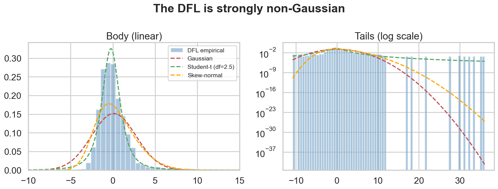
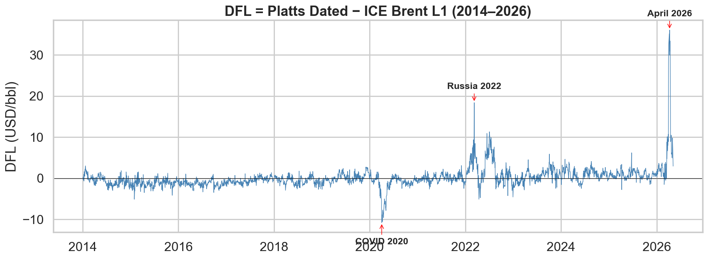
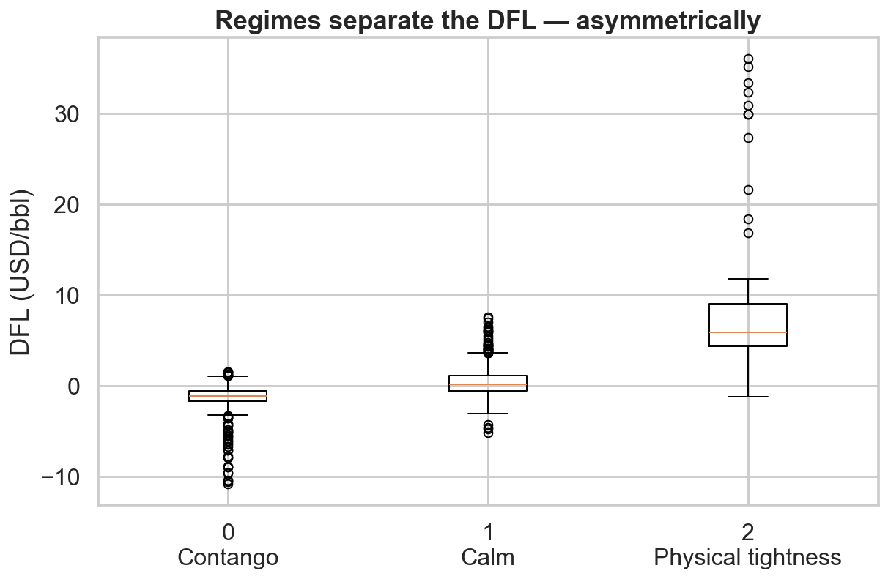
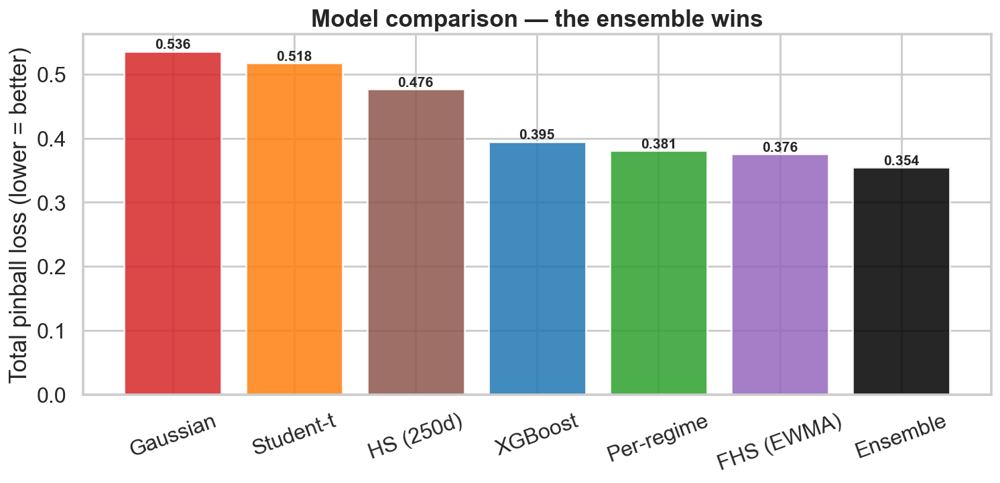
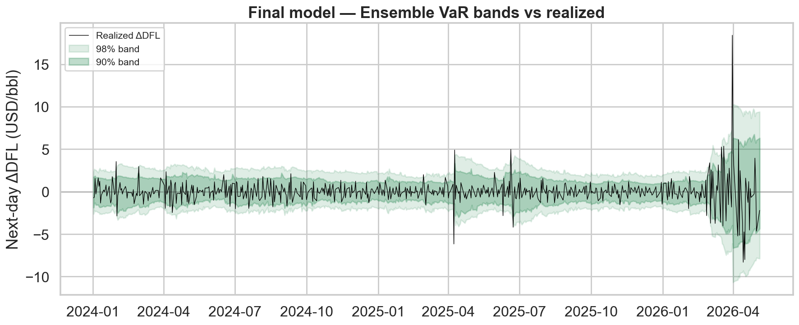
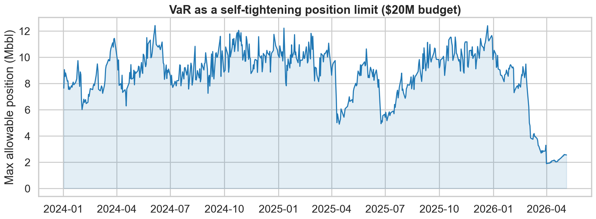

<!--
NOTE: theme is a placeholder. Once Julien provides the IFP / personal slide
template, translate it into a Marp CSS theme and swap `theme:` above (or add a

<!-- _class: lead -->

# Regime-Conditional Value-at-Risk on the DFL Brent

Modelling the basis risk of a physical crude desk

Julien — IFP School — June 2026

---

## The problem

A physical crude desk buys Dated-priced cargoes and hedges them with ICE Brent futures.

The leftover gap is the DFL — Dated Brent minus front-line ICE Brent. That gap is basis risk: a structural premium that cannot be fully arbitraged away.

It is real P&L every day, and its tail risk is what we set out to model.

---

## The challenge: the DFL is not normal

Skewness +5.5, kurtosis +62 — extreme, asymmetric fat tails. No single distribution (Gaussian, Student-t, skew-normal) fits, so a flat parametric VaR badly understates the risk.

---

## Why: it is a mixture of regimes

Calm for years, then violent — COVID 2020, Russia 2022, April 2026 (+$36). The extremes cluster, so the DFL behaves differently depending on the market state. The fix: condition the VaR on the regime.

---

## The approach

Data (12 years, 3 crude benchmarks + macro + inventories)

→ PCA — 5 interpretable factors (curve tightness, risk-off, East-West arb, momentum, trans-Atlantic)

→ K-means — 3 market regimes

→ XGBoost quantile regression — conditional VaR + conformal recalibration

→ Backtest vs 6 baselines, then an ensemble

→ Desk application, in dollars

---

## Regimes that mean something

Three directional regimes — Contango (downside), Calm, Physical tightness (upside). Built without ever using the DFL, yet they split it sharply and asymmetrically: contango down to −$11, tightness up to +$36.

---

## The model

XGBoost quantile regression on the regime plus continuous market features, predicting the quantiles of the next-day DFL move (q01 / q05 / q95 / q99).

Temporal split: train 2014–2023, test 2024–2026, so the 2026 spike is a genuine out-of-sample stress test.

An upside calibration leak appeared (q95 breached 10.7% vs 5%). After ruling out three causes, it was fixed post-hoc with split-conformal recalibration.

---

## How the models are evaluated

Two axes, not one:

- Calibration — Kupiec (right number of breaches?) and Christoffersen (are breaches clustered?). The regulatory-grade pass/fail.
- Accuracy — pinball loss, the proper scoring rule that ranks the models.

All out-of-sample, against real baselines including Filtered Historical Simulation (the bank standard).

---

## Comparison: who wins

Conditioning beats distribution: Student-t → regime cuts loss by 26%, while adding fat tails buys only 3%. No single model dominates, but the ensemble (XGBoost + FHS) wins and is the only one to pass every backtest.

---

## The final model

Tight in calm, wide in the 2026 crisis — the risk number breathes. Best pinball loss, passes all twelve backtest checks, and fixes the clustered downside breaches that XGBoost alone failed.

---

## What it means for a desk

For a position long 1,000,000 bbl of DFL:

- 1-day 99% VaR ≈ $2.7M in calm markets, ballooning past $10M in April 2026.
- Expected Shortfall: when the 95% VaR breaks, the average loss is 2.25× the threshold.

The tail is worse than the VaR line suggests — which is exactly why Basel III / FRTB uses Expected Shortfall.

---

## VaR as a self-tightening position limit

Run in reverse: a fixed risk budget sets the allowed position. For a $20M daily VaR budget, the desk can run ~12 Mbbl in calm and under 2 Mbbl in the crisis — a 6–7× cut, automatically, exactly when it matters.

---

## Limits, stated honestly

- The April 2026 move exceeds anything in training — VaR must be complemented by stress testing.
- The regimes are fit on the full sample (look-ahead); production would refit walk-forward.
- Part of the measured daily move is snap-time noise (Platts 16:30 vs ICE 19:30), not real risk.
- The statistically best VaR is not the most usable — FHS's crisis spikes are pro-cyclical.

---

## Takeaways

- An end-to-end regime-conditional VaR, calibrated and formally validated.
- Conditioning on the market state matters far more than the choice of distribution.
- The ensemble is the only fully-calibrated model — structure (XGBoost) plus volatility (FHS).
- Made tangible: dollar VaR, Expected Shortfall, and position sizing.
- And honest about where, and why, it reaches its limits.

---

<!-- _class: lead -->

# Thank you

Code and notebooks: github.com/juliens50/ML-project-VaR-Calculation-for-Basis-Risk

Questions?
